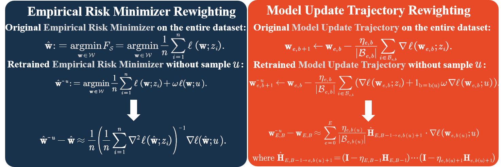

# Results During Rebuttal Period
[Go to Experiments suggested by Reviewer ia1D](#reviewer-ia1d)

[Go to Experiments suggested by Reviewer t2wR](#reviewer-t2wR)

## Experiments suggested by  Reviewer ia1D

We have conducted experiments with a multilayer perceptron (MLP) with an input layer, ReLU, dropout, and a hidden layer on additional datasets from [UCI Machine Learning Repository](https://archive.ics.uci.edu/), including **[Wine](https://archive.ics.uci.edu/dataset/186/wine+quality)**, **[HAPT](https://archive.ics.uci.edu/dataset/240/human+activity+recognition+using+smartphones)**, **[Adult](https://archive.ics.uci.edu/dataset/2/adult)**,  and **[Obesity](https://archive.ics.uci.edu/dataset/544/estimation+of+obesity+levels+based+on+eating+habits+and+physical+condition)**, for tasks such as wine quality classification, human activity recognition, income classification, and estimation of obesity levels, respectively.
Below are our experimental results.

### Wine Dataset

| Remove 5%    | Distance (±std)             | Unlearning time  (Sec) | Storage  (MB) | Precomputing time (Sec) |
| ------------ | --------------------------- | ---------------------- | ------------- | ----------------------- |
| **IJ**       | 1.328685(±2.684761113)      | 0.31                   | 9.12          | 155.01                  |
| **NU**       | 0.713996(±0.663479114)      | 7.55                   | 9.12          | 153.16                  |
| **Proposed** | **0.042583 (±0.013055867)** | **0.0004**             | **1.06**      | **11.56**               |

| Remove 10%   | Distance (±std)            | Unlearning time (Sec) | Storage (MB) | Precomputing time (Sec) |
| ----------------------- | -------------------------- | --------------------- | ------------ | ----------------------- |
| **IJ**                  | 0.652394(±0.47713592)      | 0.31                  | 9.12         | 155.01                  |
| **NU**                  | 0.882236(±1.607668449)     | 14.34                 | 9.12         | 153.16                  |
| **Proposed**            | **0.08735 (±0.022903825)** | **0.0004**            | **1.06**     | **11.56**               |

Due to time constraints and the considerable computation time required for the Hessian, we are currently presenting only the results of our proposed method for the following datasets. Results from other algorithms will be released gradually.

### HAPT Dataset

| Remove 5%    | Distance (±std) | Unlearning time  (Sec) | Storage  (MB) | Precomputing time (Sec) |
| ------------ | --------------- | ---------------------- | ------------- | ----------------------- |
| **IJ**       |                 |                        |               |                         |
| **NU**       |                 |                        |               |                         |
| **Proposed** |                 |                        |               |                         |

### Adult Dataset

| Remove 5%    | Distance (±std) | Unlearning time  (Sec) | Storage  (MB) | Precomputing time (Sec) |
| ------------ | --------------- | ---------------------- | ------------- | ----------------------- |
| **IJ**       |                 |                        |               |                         |
| **NU**       |                 |                        |               |                         |
| **Proposed** |                 |                        |               |                         |

### Obesity Dataset

| Remove 5%    | Distance (±std) | Unlearning time  (Sec) | Storage  (MB) | Precomputing time (Sec) |
| ------------ | --------------- | ---------------------- | ------------- | ----------------------- |
| **IJ**       |                 |                        |               |                         |
| **NU**       |                 |                        |               |                         |
| **Proposed** |                 |                        |               |                         |

##  Quick Start

        bash ./codebase/Wine.sh
        bash ./codebase/HAPT.sh
        bash ./codebase/Adult.sh
        bash ./codebase/Obesity.sh
        

## Experiments suggested by  Reviewer t2wR

learn_Tradeoff.svg "Analysis between smaller approximation error and insufficient  model training caused by step size")

**Configuration:** We conduct experiment on MNIST and keep the other hyperparameters fixed and adjust the learning rate from 0.001 to 0.31.

**Observation and Analysis:** Under a fixed iteration budget, we observe the following phenomena from the Figure: (1) When the step size is small (less than the threshold $\eta_1 = 0.01$), the training is often insufficient, leading to lower test accuracy. (2) Increasing the step size ensures sufficient training, but when the learning rate becomes too large, overfitting and instability lead to a decrease in test accuracy. We also observe the following phenomena in the unlearning process: (1) When the step size is below a threshold $\eta_2 = 0.25$, the growth of approximation error is extremely slow. (2) However, once the step size exceeds this threshold, the error grows exponentially (which is consistent with the conclusion of Theorem 4.)

Therefore, based on the above Figure, we conclude that under this setup, there exists an optimal step size that achieves the best test accuracy while maintaining a small approximation error. However, we are not aware of any optimization problem yielding the results shown in the FIGURE above. When $\eta_1 > \eta_2$, the optimal learning rate must be set to $\eta_2$, which, although rare, inevitably leads to insufficient training.

Overall, since our method is less affected by the step size when below the threshold, there is no noticeable tradeoff.

##  Quick Start

        bash Ablation_Re.sh

------

# Introduction

This temporary repository is the supplementary code of the paper "**Efficient and Generalizable Second-Order Unlearning: A Hessian-Free Online Model Updates Approach**".

**Existing Second-Order Certified Unlearning Schemes:**  
- *In the left figure* (**NS**, **IJ** Methods), the weighting factor $\omega=0$ represents the original Empirical Risk Minimizer , while $\omega=-\frac{1}{n}$ indicates the retrained Empirical Risk Minimizer .  
- *In the right figure* (**HF** Method), the weighting factor $\omega=0$ represents the original Model Update, and $\omega=-1$ represents the retrained Model Update.

# Quick Start Guide
### 1. Model Learning and Unlearning
We first obtain the learned model and the unlearned models, which can be done using the following commands:

**Proposed Hessian-Free method**:

        python3 -u main_proposed.py --model logistic --dataset mnist --epochs 15  --num_dataset 1000 --batch_size 32 --num_forget 50 --lr 0.05  --regularization 0.5 --lr_decay 0.995 --clip 5 --gpu 0  --seed 124
        
**Retraining method**:

        python3 -u main_retrain.py --model logistic --dataset mnist --epochs 15  --num_dataset 1000 --batch_size 32 --num_forget 50 --lr 0.05  --regularization 0.5 --lr_decay 0.995 --clip 5 --gpu 0  --seed 124

We commented out the evaluation of NS and IJ in utils/Evaluate_Euclidean.py, so you can skip NS and IJ and directly evaluate our proposed method (as computing the Hessian takes a considerable amount of time). If you want to evaluate NS and IJ, please uncomment the code and execute the following commands:

**Newton Step method (Unofficial implementation)**:

        python3 -u main_NU.py --model logistic --dataset mnist --epochs 15  --num_dataset 1000 --batch_size 32 --num_forget 50 --lr 0.05  --regularization 0.5 --lr_decay 0.995 --clip 5 --gpu 0  --seed 124

**Infinitesimal Jackknife method (Unofficial implementation)**:

        python3 -u main_IJ.py --model logistic --dataset mnist --epochs 15  --num_dataset 1000 --batch_size 32 --num_forget 50 --lr 0.05  --regularization 0.5 --lr_decay 0.995 --clip 5 --gpu 0  --seed 124

All results are included in ./log.

### 2. Evaluate Distance
We then evaluate the $L_2$ norm between unleaned model and retrained model:

        python3 -u main_eva.py --model logistic --dataset mnist --epochs 15  --num_dataset 1000 --batch_size 32 --num_forget 50 --lr 0.05 --regularization 0.5 --lr_decay 0.995 --clip 5 --gpu 0  --seed 124

All results are included in ./results.

### 3. Membership Inference Attack
Finally, we conduct the MIA (Membership Inference Attack) evaluation:

        python3 -u main_MIAU.py --model logistic --dataset mnist --epochs 15 --num_dataset 1000 --batch_size 32 --num_forget 50 --lr 0.05  --regularization 0.5 --lr_decay 0.995 --clip 5 --gpu 0 --seed 124
        python3 -u main_MIAL.py --model logistic --dataset mnist --epochs 15 --num_dataset 1000 --batch_size 32 --num_forget 50 --lr 0.05  --regularization 0.5 --lr_decay 0.995 --clip 5 --gpu 0 --seed 124

All results are included in ./results.

# Experiments Codebase
This section contains the bash scripts to run all the experiments for the paper.

    bash ./codebase/MNIST.sh
    bash ./codebase/FMNIST.sh
    bash ./codebase/Cifar.sh
    bash ./codebase/CelebA.sh
    bash ./codebase/LFW.sh
    bash ./codebase/MIAL.sh
    bash ./codebase/MIAU.sh
    bash ./codebase/Ablation.sh
